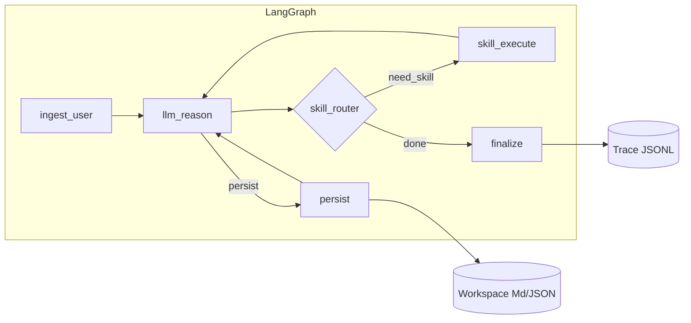

# SiuhungClaw 开发需求文档（DevList）

> 版本：0.4  
> 状态：草案  
> 编排引擎：**LangGraph**（显式 `StateGraph`）  
> 实现语言：**Python 3.11+**

---

## 1. 背景与定位

### 1.1 为什么要做

在「个人/小团队可部署、行为可解释、依赖可审计」的前提下，用 Python 实现一套**轻量级、高透明度**的 AI Agent 系统，**对标并优化 OpenClaw**（请以 OpenClaw 官方仓库与文档为准，将具体链接补入附录 A；本文档中的「OpenClaw 能力」以**可观测的 Agent 循环、工具/技能扩展、会话与任务状态管理**为基线假设）。

### 1.2 产品定位（本地数字副手）

本项目不追求构建庞大的 SaaS 平台，而是打造运行在本地的、拥有「真实记忆」的 Agent。差异化定位：

- **文件即记忆 (File-first Memory)**：默认以 Markdown / JSON 与目录约定承载记忆与中间态，人类可读；若引入向量检索，须为可选插件且可关闭。
- **技能即插件 (Skills as Plugins)**：遵循 Agent Skills 范式，文件夹即能力，拖入即用。
- **透明可控**：System Prompt 拼接、工具调用、记忆读写对开发者可见，拒绝黑盒。

### 1.3 与 README 愿景对齐

- **文件优先**：默认不依赖向量数据库；检索增强见第 4 节增强能力与第 6 节工具 `search_knowledge_base`。
- **技能模型**：优先**指令式技能（Instruction / Skill）**；Function-Call 仅作为可选执行通道。
- **全链路可观测**：规划、分支、工具调用、读写文件、错误与重试可记录、可导出、可回放（见第 9.4 节）。

---

## 2. 核心目标（必须达成）

| 编号 | 目标 | 验收要点 |
|------|------|----------|
| G1 | **Python 单栈 + 全栈交付** | 可 `pip install`/源码安装；**最终交付**为**前后端分离全栈产品**（第 10、11、18 节）；开发期可辅以 CLI |
| G2 | **LangGraph 编排** | 主循环以 **StateGraph**（或等价图）表达；节点职责清晰、边条件可测试 |
| G3 | **轻量** | 核心依赖可控；默认安装不含重型向量库；冷启动与单次任务延迟在文档中给出基线 |
| G4 | **高透明** | 每次运行的 trace（结构化 JSONL 或等价）可落盘；关键状态 diff 可读 |
| G5 | **OpenClaw 能力复刻** | 多轮对话、任务分解、工具/技能执行、持久化工作区、失败恢复（与上游差距在 CHANGELOG 中说明） |
| G6 | **可优化点显式化** | 更清晰的图结构、更细粒度事件、更弱的隐式魔法（配置即文档） |

---

## 3. 设计原则

1. **显式优于隐式**：状态 schema、图节点、技能契约在代码与文档中可读。
2. **默认安全**：文件写入范围、外部命令、网络访问需策略与白名单（可配置）。
3. **可测试**：图节点与技能执行器单元测试；集成测试使用 mock LLM / 录制响应。
4. **渐进增强**：MVP 先跑通「单 Agent + 本地技能 + 文件工作区」，再扩展多 Agent / 子图。

---

## 4. 能力分层：MVP 核心子集 vs 增强能力

**本文档以「轻量、文件优先、LangGraph 显式编排」为主轴**；**项目最终须交付前后端全栈**（第 10、11、18 节）。向量检索等重能力可作为**可选安装（extras）**默认关闭，**不免除** HTTP API 与 Web 前端交付。

### 4.1 MVP / Agent 核心子集

以下构成**最小可交付 Agent 运行时**，不依赖向量库与完整 Web UI，验收优先于增强项：

| 能力域 | 内容 | 备注 |
|--------|------|------|
| 编排 | LangGraph `StateGraph` 主循环；可测节点与条件边 | **以显式 LangGraph 为准**。若上层使用 LangChain `create_agent` 作封装，须在文档中说明且图行为可导出/可测 |
| 对话与状态 | 多轮消息、会话持久化（JSON）、可选 checkpoint | 会话路径见第 8.4 节 |
| 工具（最小集） | 至少工作区内读文件、受限写或 persist 落盘；可选一项安全受限执行 | 不强制一次上齐第 6 节五大 Core Tools |
| 技能 | 扫描 `skills/`（或约定目录），`SKILL.md` + 元数据；指令驱动 | 见第 7 节 |
| 记忆与提示词 | 文件型长期记忆 + System Prompt 分块拼接 | 见第 8 节 |
| 可观测 | 结构化 trace（JSONL 等） | 见第 9.4 节 |

### 4.2 增强能力（渐进交付）

**HTTP API + Web 前端为最终必交项**（与 Agent 核心可并行，验收可晚于 MVP）。其余在 MVP 稳定后按模块打开；**默认安装包可不包含**向量与重型索引依赖：

| 增强项 | 说明 |
|--------|------|
| 知识库 RAG | 目录摄取、混合检索（BM25 + 向量）、本地索引持久化；与第 6.5 节 `search_knowledge_base`、LlamaIndex 一致 |
| 内置工具全集 | 第 6 节五大 Core Tools 全部就绪 |
| HTTP API | 第 10 节：FastAPI、固定端口、SSE、`/api/files`、会话列表等 |
| 前端 IDE | 第 11 节：Next.js 三栏、Monaco、会话与记忆编辑 |

### 4.3 编排与知识栈选型说明

| 维度 | 本项目约定 |
|------|------------|
| 编排入口 | **显式 LangGraph** `StateGraph` 与 state；不采用旧版 `AgentExecutor` / 旧式 `create_react_agent` |
| 与 LangChain 1.x | 若使用 `create_agent`，仅作封装层，底层须与可测图一致 |
| 默认知识栈 | **无向量库**；RAG 为可选插件 |
| 交付形态 | **最终**前后端全栈；MVP 可先 CLI/最小 API 验收内核 |

---

## 5. 技术栈与约束

### 5.1 全栈架构（最终产品）

- **架构**：**前后端分离**；后端为纯 API 进程，前端独立构建与部署。
- **后端语言**：Python **3.11+**（强制类型注解）。
- **Web 框架**：**FastAPI**（RESTful + 异步，见第 10 节）。
- **Agent 编排**：**LangGraph**（图、checkpoint、可选 interrupt），主控制流须可在代码中阅读与测试。
- **RAG（可选）**：**LlamaIndex Core**，非结构化文档混合检索（Hybrid Search），作 Agent 知识外挂；默认可不安装。
- **模型接口**：兼容 **OpenAI API** 格式（OpenRouter、DeepSeek、Claude 等直连）。
- **数据存储**：以**本地文件系统**为主，不引入 MySQL/Redis 等重型依赖。

### 5.2 前端（最终产品）

- **框架**：**Next.js 14+**（App Router）、**TypeScript**（见第 11 节）。
- **UI**：Shadcn/UI、Tailwind CSS、Lucide Icons；编辑器 **Monaco Editor**。

### 5.3 必选（后端内核）

- **LangGraph**：图编排、检查点与可选人机在环。
- **LLM 接入**：抽象 `LLMProvider`；至少一种 OpenAI 兼容实现；禁止在业务节点硬编码供应商。

### 5.4 默认不包含（除非 optional extra）

- 向量数据库、重型 RAG 流水线（随 extras 启用）。
- 隐式全局单例状态（除文档化的进程内缓存）。

### 5.5 推荐（按需）

- **结构化配置**：`pydantic-settings` 或等价。
- **日志**：`structlog` 或标准 `logging` + JSON formatter。
- **CLI**：`typer` 或 `argparse`。

---

## 6. 五大内置工具（Core Tools）

系统除用户 Skills 外，须内置下列 **5 个核心基础工具**，优先使用 LangChain 生态原生工具；**工具名称**与下表一致，供 System Prompt 与技能协议引用。

### 6.1 命令行（terminal）

- **功能**：在受限安全环境下执行 Shell 命令。
- **实现**：`langchain_community.tools.ShellTool`。
- **配置**：`root_dir` 限制工作范围；黑名单拦截高危指令（如 `rm -rf /`）。

### 6.2 Python REPL（python_repl）

- **功能**：逻辑计算、数据处理、脚本执行。
- **实现**：`langchain_experimental.tools.PythonREPLTool`。
- **配置**：临时交互环境；确保 experimental 依赖正确安装。

### 6.3 网络获取（fetch_url）

- **功能**：按 URL 获取网页内容，作为联网能力。
- **实现**：`langchain_community.tools.RequestsGetTool`。
- **增强**：原始 HTML Token 消耗大，须 Wrapper，用 BeautifulSoup 或 html2text 清洗为 Markdown 或纯文本再返回。

### 6.4 文件读取（read_file）

- **功能**：读取本地文件；Skills 依赖此工具读取 `SKILL.md`。
- **实现**：`langchain_community.tools.file_management.ReadFileTool`。
- **配置**：`root_dir` 为项目/工作区根，禁止越界读系统路径。

### 6.5 RAG 检索（search_knowledge_base）

- **功能**：针对知识库内容（非对话历史）做深度检索。
- **技术**：LlamaIndex。
- **实现**：扫描如 `knowledge/` 下 PDF/MD/TXT 建索引；**Hybrid Search**（BM25 + 向量）；索引持久化到本地如 `storage/`。
- **备注**：与第 4.2 节「可选 RAG」一致，可分阶段上线。

---

## 7. Agent Skills 系统

### 7.1 范式

遵循 **Instruction-following（指令遵循）**，而非把业务逻辑唯一绑死在 Function-call。技能是「如何用基础工具完成任务」的说明书，以**文件夹**形式存放（如 `backend/skills/` 或项目约定路径）。

### 7.2 载入（Bootstrap）

启动或会话开始时扫描 `skills/`，读取每个 `SKILL.md` 的 Frontmatter，汇总生成 **`SKILLS_SNAPSHOT.md`**，示例结构：

```plaintext
<available_skills>
  <skill>
    <name>get_weather</name>
    <description>获取指定城市的实时天气信息</description>
    <location>./backend/skills/get_weather/SKILL.md</location>
  </skill>
</available_skills>
```

`location` 统一为相对路径。

### 7.3 执行流程（四步）

1. **感知**：System Prompt 含 available_skills。
2. **决策**：用户请求匹配技能名。
3. **行动**：**不直接调函数**，先用 `read_file` 读取 `location` 指向的 `SKILL.md`。
4. **执行**：按 Markdown 步骤，结合 Core Tools（`terminal`、`python_repl`、`fetch_url` 等）完成任务。

### 7.4 与 DevList 图节点关系

技能发现、路由、执行对应编排中的 `skill_router` / `skill_execute`（第 9.1 节）；可将技能**映射**为工具定义供模型调用，**真相来源**仍是技能清单与文件内容。

---

## 8. 对话记忆与 System Prompt

### 8.1 本地优先

记忆文件（Markdown/JSON）存本地文件系统，保障数据主权与可解释性；无强制云端同步、无第三方采集（产品策略若有变更须文档说明）。

### 8.2 System Prompt 拼接顺序

按固定顺序动态拼接 **6** 部分；**单文件字符上限 20k**，超出截断并标注 `...[truncated]`。顺序如下：

1. `SKILLS_SNAPSHOT.md`（能力列表）
2. `SOUL.md`（核心设定）
3. `IDENTITY.md`（自我认知）
4. `USER.md`（用户画像）
5. `AGENTS.md`（行为准则与记忆操作指南）
6. `MEMORY.md`（长期记忆）

### 8.3 AGENTS.md 初始化要求

Agent 初始须具备明确技能协议，**技能调用协议**至少包含：

- 拥有技能列表（SKILLS_SNAPSHOT），含能力与定义文件位置。
- **第一步**必须是使用 `read_file` 读取 `location` 下 Markdown。
- 阅读步骤与示例后，再用 Core Tools（`terminal`、`python_repl`、`fetch_url` 等）执行。
- **禁止**在未读文件前猜测参数或用法。

（记忆协议等其余段落可并列维护。）

### 8.4 会话存储（Sessions）

- **路径示例**：`backend/sessions/{session_name}.json`（可按项目调整，须文档化）。
- **格式**：JSON 数组，记录 `user`、`assistant`、`tool`（含 function calls）等消息，保留全量上下文。

---

## 9. 功能需求（运行时、工作区、可观测、入口）

### 9.1 运行时与编排（LangGraph）

- **State**：`AgentState`（或分层）含 `messages`、`plan`（可选）、`pending_tool_calls`、`workspace_refs`、`metrics`、`errors` 等；变更规则文档化。
- **Nodes**（至少）：`ingest_user` → `llm_reason` → `skill_router` →（`skill_execute`）→ `persist` → `finalize`；条件边支持继续推理、执行技能、澄清、终止、错误恢复（有限重试 + 熔断）。
- **Checkpoint**：会话级恢复（`thread_id`）；后端可先内存，再文件/SQLite。

### 9.2 文件驱动工作区

- **根目录**：可配置；相对路径基于此解析。
- **产物**：计划、日志、答复草稿等多用 **Markdown**；机器可读用 **JSON** / JSONL。
- **策略**：约定覆盖 vs 追加；可用 manifest 记录版本。

### 9.3 技能发现与执行（摘要）

目录约定、`SKILL.md` 元数据、指令驱动 — 细节见第 7 节。

### 9.4 可观测性

- **事件类型**：如 `state_patch`、`llm_request`、`llm_response`、`skill_start/end`、`file_write`、`graph_transition`。
- **导出**：每次运行 `run_id` 目录或单文件 trace。
- **隐私**：trace 默认脱敏（API Key、令牌、路径中的用户信息等）。

### 9.5 接口形态

- **CLI**（可选）：如 `siuhung run`、`siuhung chat --thread ...`。
- **HTTP + 前端**（最终交付）：第 10、11 节。

---

## 10. 后端 API 规范（FastAPI）

后端独立进程，负责 Agent、文件与状态管理。**默认端口 `8002`**，基础 URL `http://localhost:8002`（若变更须在 README/配置中统一说明）。

### 10.1 对话

- **Endpoint**：`POST /api/chat`
- **作用**：接收用户消息，返回 Agent 回复。
- **请求体示例**：

```json
{
  "message": "查询一下北京的天气",
  "session_id": "main_session",
  "stream": true
}
```

- **响应**：支持 **SSE** 流式输出，推送思考过程（Thought / Tool Calls）与最终回复。

### 10.2 文件（前端编辑器）

- **读**：`GET /api/files`，Query `path=memory/MEMORY.md`，返回文件内容。
- **写**：`POST /api/files`，body `{"path": "...", "content": "..."}`，用于 Memory、Skill 等编辑保存。

### 10.3 会话列表

- **Endpoint**：`GET /api/sessions`
- **作用**：返回历史会话列表，支持按时间排序展示。

---

## 11. 前端开发要求

### 11.1 布局（IDE 风格）

- **左侧 (Sidebar)**：导航（Chat / Memory / Skills）+ 历史会话列表。
- **中间 (Stage)**：对话流 + 可折叠思考链（Collapsible Thoughts）。
- **右侧 (Inspector)**：**Monaco** 编辑当前 `SKILL.md` 或 `MEMORY.md` 等。

### 11.2 技术栈

- Next.js 14+（App Router）、TypeScript。
- Shadcn/UI、Tailwind CSS、Lucide Icons。
- Monaco Editor（默认 Light Theme 可配置）。

### 11.3 UI/UX

- **风格**：浅色 Apple 系（Frosty Glass），背景白/极浅灰（如 `#fafafa`），毛玻璃；强调色可选克莱因蓝或活力橙。
- **顶栏**：固定、半透明；左侧产品标识（如「SiuhungClaw」），右侧外链（如「赋范空间」→ `https://fufan.ai`）可按品牌调整。

### 11.4 与后端集成

- 前端通过环境变量或配置指向后端基址（默认 `http://localhost:8002`），封装 API（如 `src/lib/api.ts`）。

---

## 12. 推荐目录结构

```plaintext
mini-openclaw/   # 或 SiuhungClaw 仓库根
├── backend/
│   ├── app.py                 # 入口，绑定端口 8002
│   ├── memory/
│   │   ├── logs/
│   │   └── MEMORY.md
│   ├── sessions/
│   ├── skills/
│   │   └── example_skill/
│   │       └── SKILL.md
│   ├── workspace/             # System Prompt 组件
│   │   ├── SOUL.md
│   │   ├── IDENTITY.md
│   │   ├── USER.md
│   │   └── AGENTS.md
│   ├── tools/                 # Core Tools 封装
│   ├── graph/                 # LangGraph 定义
│   └── requirements.txt
├── frontend/
│   ├── src/
│   │   ├── app/
│   │   ├── components/
│   │   │   ├── chat/
│   │   │   └── editor/
│   │   └── lib/
│   │       └── api.ts
│   └── package.json
└── README.md
```

---

## 13. 非功能需求

| 类别 | 要求 |
|------|------|
| 性能 | 图深度与 LLM 轮次可配置上限；避免无界循环 |
| 可靠性 | 技能超时、部分失败降级、可重试节点清单明确 |
| 安全 | 路径穿越防护、命令注入防护、敏感配置仅环境变量/密钥文件 |
| 可维护 | 模块边界：providers / graph / skills / workspace / observability |
| 许可 | 与仓库 LICENSE 一致；第三方依赖记录 NOTICES |

---

## 14. 架构示意（逻辑）



---

## 15. 里程碑建议

| 阶段 | 交付物 | 完成标准 |
|------|--------|----------|
| M0 | 仓库骨架、配置、最小 README | `python -m ...` 或 CLI 打印版本与配置 |
| M1 | LangGraph 主循环 + mock LLM | 单测覆盖主要边；生成 trace |
| M2 | 真实 LLM + 示例技能 + 工作区写文件 | 端到端 demo |
| M3 | Checkpoint、错误恢复、脱敏 trace | 中断可续跑；安全基线文档 |
| M4 | 与 OpenClaw 功能矩阵对照表 | 已实现/未实现/刻意不实现 |
| M5 | **前后端全栈产品** | 第 18 节验收标准 |

---

## 16. 风险与开放问题

- **OpenClaw 行为细节**：与假设不一致时，更新功能矩阵或附录。
- **LangGraph 版本与 checkpoint 后端**：在 `pyproject` 锁定版本并文档化升级注意点。
- **技能沙箱**：本地执行与 Docker/VM 沙箱取舍影响复杂度。

---

## 17. 文档维护

- 更新版本号与功能矩阵索引（可在 `docs/` 或 README）。
- 图结构或 state schema 变更须同步本文相关章节。

---

## 18. 最终交付验收（全栈产品）

**结项须满足**：

| 类别 | 交付内容 | 验收要点 |
|------|----------|----------|
| **后端** | 第 5、10 节：FastAPI、第 6 节工具策略与实现路径、第 9 节图运行时 | 端口与路由可配置但默认与第 10 节一致；SSE 可用；`/api/files`、`/api/sessions` 行为符合规范 |
| **前端** | 第 11 节：Next.js 三栏、Monaco、会话与记忆编辑 | 可连后端完成主路径；构建与部署说明完整 |
| **集成** | 前后端分离；CORS/代理/环境变量文档化 | 文档所述环境下可跑通 |

**说明**：向量 RAG、五大工具全集等可分期达到第 6 节完整度，**不替代**上述全栈交付。

---

*本文件为 SiuhungClaw 项目开发需求与验收的单一事实来源（全栈与 Agent 规格以本文为准）。*

---

## 附录 A：OpenClaw 参考链接（请维护者填入）

- 官方仓库：  
- 文档 / 能力说明：  
- 与本项目差异笔记（可选）：
